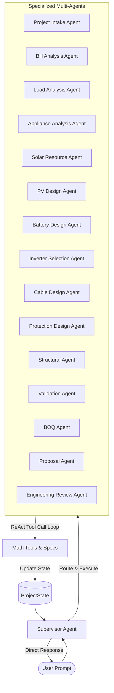

# Solar Design AI Agent — Enterprise PV System Sizing & BOQ Suite

An enterprise-grade, AI-powered solar PV design, system sizing, and Bill of Quantities (BOQ) generation suite. The platform features a **Dual-Brain / Triple-Engine AI Architecture** (using **Google Gemini**, **GitHub Models `your-github-model-name-here`**, and **Featherless AI / DeepSeek-V3.1-Terminus**), an autonomous **Multi-Agent Orchestration Engine**, a deterministic engineering sizing math module applying international standards (IEC 62548, IEC 60364, AS/NZS 4509), and a database persistence layer backed by **Supabase**.

---

## 🚀 Key Features

*   **Multi-Agent Orchestration:** 14 autonomous agents working via a supervisor model using a tool-calling **ReAct loop** to intake requirements, analyze inputs, select equipment, size strings/conductors, and produce outputs.
*   **Standard-Compliant Math Engine:** Applies strict mathematical formulas to size PV arrays, battery capacity, inverter counts, and DC/AC cables.
*   **Dynamic Datasheet Knowledge Base:** Automatically loads and reads technical specifications from manufacturer datasheet PDFs, JSON schemas, or Excel logs for panels (Jinko), inverters (Huawei, Deye, Solis, GoodWe), and batteries (Dyness).
*   **Rich Interactive Dashboard:** Built with Streamlit, styled with a pixel-accurate dark dashboard theme featuring a bottom utility taskbar, active status monitors, and interactive Plotly metrics.
*   **Procurement-Ready BOQs:** Generates clean, download-ready Excel workbooks (`.xlsx` using `openpyxl`) and formatted Markdown BOQ tables divided into 11 engineering categories.
*   **Robust Session & Project Persistence:** Automatically saves conversation state, user profiles, historical messages, and design snapshots directly to Supabase.

---

## 🛠️ Multi-Agent Architecture (`agent/multiagent`)

The conversation, calculations, and validations are managed by a hierarchy of 14 specialized agents overseen by a **Supervisor Agent** (`SupervisorAgent` in [supervisor.py](file:///f:/Downloads/NES%20Work/Solar%20Design%20Agent/Solar-Design-Agent/agent/multiagent/supervisor.py)). The supervisor receives the user's prompt, inspects the current `ProjectState`, and routes the task to the correct agent or replies directly.



### Specialized Agents & Roles:
1.  **Project Intake Agent:** Collects details, identifies system type (`grid-tied`, `hybrid`, `off-grid`), location, and general scoping parameters.
2.  **Bill Analysis Agent:** Translates utility bill consumption values (monthly kWh and billing cycles) into daily load estimates.
3.  **Load Analysis Agent:** Processes time-series interval logger files (CSV/Excel) using apparent power totals.
4.  **Appliance Analysis Agent:** Calculates daily energy demand and peak loads from discrete list inputs.
5.  **Solar Resource Agent:** Pinpoints location Peak Sun Hours (PSH) using built-in lookups.
6.  **PV Design Agent:** Sizes the required DC Capacity, Panel Qty, and calculates string configurations based on temperature coefficients.
7.  **Battery Design Agent:** Designs the battery bank size using safety and degradation multipliers.
8.  **Inverter Selection Agent:** Sizes and matches loads to manufacturer models, selecting correct brands (Huawei for grid-tied, Deye/Solis for off-grid/hybrid) and voltage topologies.
9.  **Cable Design Agent:** Performs copper sizing, cross-sectional area, and voltage drop calculations.
10. **Protection Design Agent:** Determines DC/AC breaker sizes and switchgear protection ratings.
11. **Structural Agent:** Evaluates roof area space constraints and mounting layout options.
12. **Validation Agent:** Executes safety, performance, and compliance checks.
13. **BOQ Agent:** Combines sized items to generate a 11-category procurement list.
14. **Proposal Agent:** Wraps the entire project metadata and outputs a proposal workbook.
15. **Engineering Review Agent:** Produces a final summary document detailing engineering assumptions, warnings, and design suggestions.

---

## 📐 Detailed Sizing Math & Engineering Formulas

### 1. Load Profile Analysis & Estimation
The sizing inputs ($E_{\text{daily}}$, $P_{\text{peak}}$, $S_{\text{peak}}$) are calculated from three independent data sources:

*   **Appliance Load Profiles (Manual Schedules):**
    $$E_{\text{daily}} = \sum_{i} \left( P_i \times \text{Qty}_i \times \text{Hours}_i \right)$$
    $$S_{\text{peak}} = \frac{\sum P_{\text{simultaneous}, i}}{PF_i}$$
    *Where active power $P_i$ is in W, and default Power Factor $PF$ is $0.85$.*

*   **Time-Series Logger Logs (CSV/Excel):**
    First filters for weekdays, groups records into calendar days, and extracts the daily energy of the worst-case (maximum energy sum) day:
    $$E_{\text{daily}} = \left( \sum_{k=1}^{N} S_k \right) \times \Delta t_{\text{hours}}$$
    *Where $S_k$ is the apparent power reading in kVA, and $\Delta t_{\text{hours}}$ is the sampling interval (e.g. 15 mins = 0.25 hrs).*

*   **Utility Bill Analysis:**
    If only billing kWh is given, average daily energy is adjusted by an expansion safety factor, and peak active power is derived using typical load factors:
    $$E_{\text{daily}} = \frac{\text{Monthly Consumption}_{\text{kWh}}}{\text{Billing Days}} \times (1 + \text{Expansion Factor})$$
    $$P_{\text{peak}} = \frac{E_{\text{daily}}}{24 \times LF}$$
    *Where Load Factor $LF$ is $0.3$ (Residential), $0.5$ (Commercial), or $0.7$ (Industrial).*

---

### 2. Solar PV Sizing (Rule 1)
PV array capacity is sized strictly against Peak Sun Hours (PSH) with **no loss factors applied** during direct calculation:
*   **Required DC Capacity ($P_{\text{pv, req}}$ in kWp):**
    $$P_{\text{pv, req}} = \frac{E_{\text{daily, kWh}}}{PSH}$$
*   **Number of PV Panels ($N_{\text{panels}}$):**
    $$N_{\text{panels}} = \left\lceil \frac{P_{\text{pv, req}} \times 1000}{P_{\text{panel, Wp}}} \right\rceil$$
*   **Actual Installed DC Capacity ($P_{\text{pv, actual}}$ in kWp):**
    $$P_{\text{pv, actual}} = \frac{N_{\text{panels}} \times P_{\text{panel, Wp}}}{1000}$$

---

### 3. Inverter Sizing & Architecture Selection
Inverters are selected by scaling active/apparent demand by a **$1.25\times$ safety margin** to prevent overload from starting transients:
$$P_{\text{inv, req}} = \max\left(P_{\text{pv, actual}}, \frac{P_{\text{peak}} \times 1.25}{1000}\right)$$
*   **Grid-Tied Systems:** Defaults to Huawei SUN2000 Series (High Voltage: 1100V DC).
*   **Hybrid / Off-Grid ($\le 15$kW & $48$V BESS):** Defaults to Low Voltage Hybrid (LV: 48V Battery / 500V DC Voc) using Deye, Solis, or GoodWe.
*   **Hybrid / Off-Grid ($> 15$kW or HV BESS):** Defaults to High Voltage Hybrid architecture (HV: 1000V DC Voc / 384V+ BESS).

---

### 4. MPPT Configuration & PV Stringing
*   **Temperature-Adjusted Open-Circuit Voltage ($V_{oc,\text{adj}}$):**
    $$V_{oc,\text{adj}} = V_{oc} \times \left[ 1 + K_v \times (T_{\min} - 25) \right]$$
    *Where nominal Voc is from module datasheet, $K_v$ is the temperature coefficient (typically $-0.0029$ V/°C), and $T_{\min}$ is the minimum ambient site temperature (default $10^\circ$C).*
*   **Maximum Panels per String ($N_{\text{string, max}}$):**
    $$N_{\text{string, max}} = \left\lfloor \frac{V_{\text{inv, max}}}{V_{oc,\text{adj}}} \right\rfloor$$
*   **Panels per MPPT Limit:**
    $$\text{Panels per MPPT} = \left\lfloor \frac{P_{\text{inv, std}} \times \text{Overloading Factor}}{N_{\text{mppts}} \times (P_{\text{panel, Wp}} / 1000)} \right\rfloor$$
    *Where overloading factor is $1.3$ for LV inverters and $1.5$ for HV commercial inverters.*

---

### 5. Battery Sizing (Rule 2)
Autonomy sizing implements a **mandatory $1.25\times$ aging and degradation multiplier** to secure minimum backup over a 10-year warranty cycle:
*   **Base Battery Capacity ($E_{\text{bess, base}}$ in kWh):**
    $$E_{\text{bess, base}} = \frac{E_{\text{daily}} \times \text{Days of Autonomy}}{DoD}$$
    *Where Depth of Discharge $DoD$ is $0.80$ for Lithium Chemistry.*
*   **Required Battery Capacity ($E_{\text{bess, req}}$):**
    $$E_{\text{bess, req}} = E_{\text{bess, base}} \times 1.25$$
*   **Number of Battery Modules ($N_{\text{batteries}}$):**
    $$N_{\text{batteries}} = \left\lceil \frac{E_{\text{bess, req}}}{E_{\text{module, kWh}}} \right\rceil$$
    *Where $E_{\text{module, kWh}}$ is the module capacity (e.g. 14.33 kWh for Dyness Stack280).*
*   **Battery Breaker Sizing ($I_{\text{batt, breaker}}$):**
    $$I_{\text{batt, max}} = \frac{P_{\text{inv, std}} \times 1000}{V_{\text{bess, dc}}}$$
    $$I_{\text{batt, breaker}} = \max\left(125\text{A}, \left\lceil \frac{I_{\text{batt, max}} \times 1.25}{25} \right\rceil \times 25\right)$$

---

### 6. Cable Sizing & Voltage Drop
*   **DC Conductor Area ($A_{\text{dc}}$ in mm²):**
    Calculated based on allowable 2% voltage drop across the DC run ($L_{\text{dc}}$ defaults to $50$m):
    $$A_{\text{dc}} = \frac{I_{mp} \times \rho_{\text{copper}} \times 2 \times L_{\text{dc}}}{V_{\text{allow, dc}}}$$
    *Where $I_{mp}$ is the module operating current, $\rho_{\text{copper}} = 0.0178$ $\Omega\cdot\text{mm}^2/\text{m}$ (resistivity of copper), and $V_{\text{allow, dc}} = V_{\text{string}} \times 0.02$. Round up to standard sizes ($4\text{ mm}^2$ or $6\text{ mm}^2$).*
*   **AC Current Calculation ($I_{\text{ac}}$):**
    *   **Single-Phase (1-Phase / 230V):**
        $$I_{\text{ac}} = \frac{P_{\text{inv, std}} \times 1000}{V_{\text{ac}} \times 0.9}$$
    *   **Three-Phase (3-Phase / 400V):**
        $$I_{\text{ac}} = \frac{P_{\text{inv, std}} \times 1000}{\sqrt{3} \times V_{\text{ac}} \times 0.9}$$
*   **AC Breaker Sizing ($I_{\text{breaker}}$):**
    $$I_{\text{breaker}} = \left\lceil \frac{I_{\text{ac}} \times 1.25}{10} \right\rceil \times 10$$
*   **AC Voltage Drop ($V_{\text{drop, ac}}$):**
    $$V_{\text{drop, ac}} = K_{\text{phase}} \times I_{\text{ac}} \times R_{\text{cable}} \times \left( \frac{L_{\text{ac}}}{1000} \right)$$
    *Where $K_{\text{phase}} = \sqrt{3}$ for 3-phase and $2.0$ for 1-phase, and AC cable run ($L_{\text{ac}}$) is $100$m. $R_{\text{cable}}$ is derived from temperature-adjusted copper wire resistance (e.g. $1.15$ $\Omega/\text{km}$ for $16\text{ mm}^2$, $0.727$ $\Omega/\text{km}$ for $25\text{ mm}^2$, $0.387$ $\Omega/\text{km}$ for $50\text{ mm}^2$).*

---

## 💾 Database Schema

The persistence layer resides entirely in **Supabase** (schema layout in [schema.sql](file:///f:/Downloads/NES%20Work/Solar%20Design%20Agent/Solar-Design-Agent/db/schema.sql)):

1.  **`profiles`**: User details and credentials. Configured with a PostgreSQL trigger `on_auth_user_created` to automatically sync credentials when a new user signs up. Handles security roles (`admin`, `user`).
2.  **`projects`**: Project scope folders including coordinates, location, and system categories.
3.  **`chat_sessions`**: Session-based history logs saving multi-agent messages and timestamps.
4.  **`system_designs`**:Sizing parameters, selected equipment metadata, cables, string grids, and BOQ data linked directly to active chat sessions.

---

## 📂 Equipment Datasheet Directory Structure

Drop in manufacturer specification sheets and manuals. The agent parses them at startup and references them:

```text
datasheets/
├── pv_modules/      # Jinko, JA Solar panel spec sheets (.json, .pdf)
├── inverters/       # Huawei, Deye, Solis inverter details (.json, .pdf)
├── batteries/       # Dyness Stack280 / Powerbrick battery manuals (.json, .pdf)
├── cables/          # BICC cables specifications catalogue (.json)
└── switchgear/      # Breakers, fuses, SPDs technical specifications
```

*   **PDF Spec Sheets:** Extracted via `pdfplumber` (tables and texts parsed automatically).
*   **Structured JSON Specs:** Directly parsed into dictionary key-values (maximum precision).

---

## 🚀 Getting Started

### Prerequisites
*   Python 3.10 or higher
*   Supabase Account (URL, keys, and personal token for CLI migrations)
*   Google Gemini API Key, GitHub Token, or Featherless API Key

### 1. Setup Code & Virtual Environment
```bash
# Clone the repository
git clone https://github.com/JoramMwanyika/Solar-Design-Agent.git
cd Solar-Design-Agent

# Create and activate python virtual environment
python -m venv venv
# On Windows PowerShell:
.\venv\Scripts\Activate.ps1
# On Linux/macOS:
source venv/bin/activate

# Install required python packages
pip install -r requirements.txt
```

### 2. Configure Environment Variables
Create a `.env` file in the root workspace (copy from `.env.example`):
```ini
# Google Gemini API Config
GEMINI_API_KEY=your_gemini_api_key_here

# Supabase Credentials (from settings -> API)
SUPABASE_URL=https://your-project-ref.supabase.co
SUPABASE_ANON_KEY=your_supabase_anon_key_here
SUPABASE_SERVICE_ROLE_KEY=your_supabase_service_role_key_here

# Supabase CLI Access Token (for migrations)
SUPABASE_ACCESS_TOKEN=sbp_your_token_here

# Optional: GitHub Models Brain Config
GITHUB_TOKEN=your_github_token_here
GITHUB_MODEL=your-github-model-name-here

# Optional: Featherless AI Config
FEATHERLESS_API_KEY=your_featherless_api_key_here
FEATHERLESS_MODEL=deepseek-ai/DeepSeek-V3.1-Terminus
```

### 3. Initialize Database Schema
1. Open the **Supabase Dashboard** -> Go to your project.
2. Open the **SQL Editor**.
3. Copy the entire contents of [db/schema.sql](file:///f:/Downloads/NES%20Work/Solar%20Design%20Agent/Solar-Design-Agent/db/schema.sql) and click **Run**. This establishes all tables, security roles, auto-profile triggers, and RLS policies.

### 4. Create First Admin User
Run the setup script once to provision the initial administrator account:
```bash
python create_admin.py
```
*Note: This creates the default admin user with email `jorammwanyika@gmail.com` and password `Mwanyika5081`. You can change these details in the [create_admin.py](file:///f:/Downloads/NES%20Work/Solar%20Design%20Agent/Solar-Design-Agent/create_admin.py) file before execution.*

### 5. Launch the Application
Start the Streamlit dev server locally:
```bash
streamlit run app.py
```
Open `http://localhost:8501` in your browser. Log in with the admin credentials, create a project, and begin designing.

---

## 🗄️ Database CLI Guide (`db_cli.ps1`)

Use the PowerShell script to manage Supabase migrations:

| Command | Action |
|---|---|
| `.\db_cli.ps1 status` | Show local vs. remote migration lists and status |
| `.\db_cli.ps1 diff` | Compare local schema structure against remote db |
| `.\db_cli.ps1 new <name>` | Create a new local migration file under `supabase/migrations/` |
| `.\db_cli.ps1 push` | Push all local migration files to the remote database |
| `.\db_cli.ps1 pull` | Pull the remote Supabase schema to the local schema folder |
| `.\db_cli.ps1 reset` | Reset the local development database (for local dev only) |
